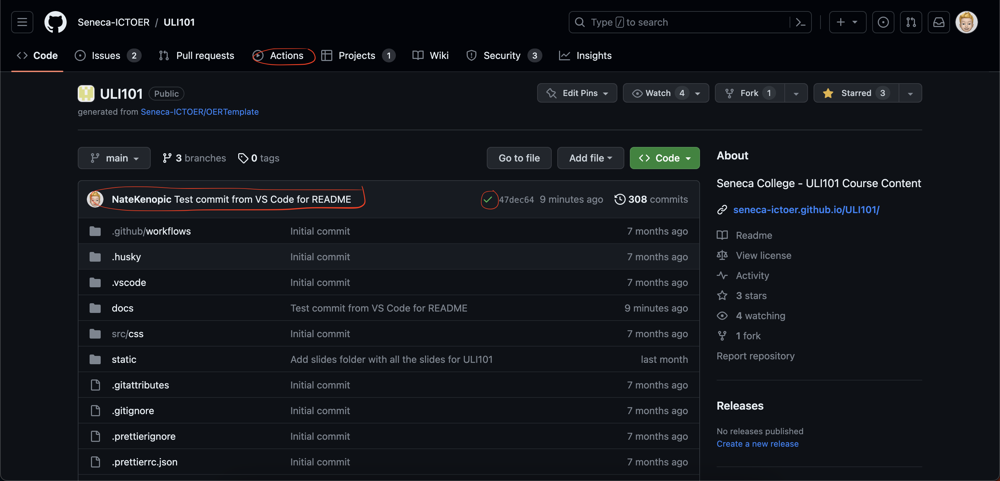

# Welcome to the ULI101 OER Repository

## Introduction

This is the new repo that stores the **ULI101 course content** from the CDOT Wiki (found here: https://wiki.cdot.senecacollege.ca/wiki/ULI101). This repo is also deployed to GitHub pages and can be found at this link: https://seneca-ictoer.github.io/ULI101/ .

This is the new Seneca-ICTOER open education resource that stores and hosts our amazing courses in their own webpages, giving Seneca ITAS staff full control over all content displayed on the page. This allows Seneca to no longer need to rely on MediaWiki/ CDOT Wiki, and instead use our own **Open Education Resource** on GitHub.

Any Seneca ITAS Faculty who has the correct permissions for this repository can make changes to any of the documents included. Please **make sure** to get the **correct permissions** first before trying to edit anything in this repository. **If you don’t have correct permissions**, you won’t be able to publish your changes and will lose all data you’ve added to the repo.

**IMPORTANT**: All content for this course **MUST** be written in GitHub Markdown, please see some helpful resources in the list below to learn markdown. **YOU MUST NOT** add any **HTML** or **CSS** code inside the .md files as it is not permitted and will result in a deployment error.

[List of Helpful GitHub Markdown Resources](#resources)

## Organization

The organization of the repo is as follows:

- The “src/css” folder contains the custom.css file that’s used for the styling of the deployed webpage. This file should not need to be edited since it does not directly affect the course content.
- The “static” folder contains:

     + The “img” folder that has all the images used in the course pages. If any new images need to be added to the course content, you **MUST** add them into this folder and reference them using the link “/img/filename.extension” or else they won’t show up on the deployed page and/or cause deployment errors.
     + The “files” folder that has all the text files, practice documents, and any other attached files for the course. **DO NOT** add any course slides or lecture notes in this folder, they will be added to the “slides” folder.
     + The “slides” folder that has all the course slides and lecture notes for the course. For example, the Weekly Lecture PowerPoints. **DO NOT** add any text files, practice documents, or any other attached files for this course, those will be added to the “files” folder from above.

-	The “docs” folder contains all the course content:

     + The “landing-page.md” is the Home page for the course on the / route from the webpage link.
     + The “weekly-schedule.md” is as it’s named, the weekly schedule for the course that describes the Learning Objectives, References, and Evaluations for the week. This page has headings for each Week with individual tables that contains the weekly content.
     + The “A-….“ and “B-….“ folders are sub-sections and are displayed as menu folders on the deployed webpage. You can add as many of these subsections as you’d like as long as you follow the guidelines in the Quick Notes below.
     + **Quick Note** about the “docs” folder. All **.md** files require a small table at the top of the file that contains an id, title(display name of file on deployed page), sidebar_position (very important, the sidebar pos is the layout of the menu on the left side of the deployed page: 1 being the top/highest on the menu, and lower on the menu for each increment), description (less important, small description for the page. Not needed for the deployment of the page but is nice for a final version of the webpage).
     + Another **Quick Note** about the “docs” folder, every subsection folder requires a “**\_category\_.json**” file that has an object {} with the label(display name of folder on the left side menu), and the position(sidebar_position) of the folder on the left side menu. This file MUST be added for the page deployment to work and for the organization to stay consistent.
     + **IF you are struggling with following the above Quick Notes**, please refer to the current **.md** files and **sub-section** folders inside the “docs” folder to see the proper way to write the markdown code for the **Quick Notes**.

**For the most part, none of the other folders/files should need to be edited aside from the "docs" folder and its contents, and the "static" folder and its contents.**

**Here's a small graphic for the files that you should focus on and edit when needed:**

Unedited version of the file structure from above:

## Modifying the Files

**There are multiple options for these files to be edited. You can pick whichever option(s) you feel most comfortable with:**

### Option 1: Using the GitHub Repo Page

Going to the GitHub repo page for this course: https://github.com/Seneca-ICTOER/ULI101 . 

**Follow the Steps below:**

1.	Follow the path: docs -> landing-page.md (see screenshot below of result)

2.	You should see the screen above. Next, click the **Edit** button that looks like a pencil (see circled in red in screenshot above)
3.	After clicking the **Edit** button, you can make any changes you’d like.
4.	Once you’ve completed your edits. Click the green button “Commit changes…” circled in red (see screenshot below)

5.	It should pop-up a dialog box (see screenshot below)

6.	Write a short message describing your changes in the “Commit message” line (good to keep other people using the repo up to date on what you’ve changed) and click the green “Commit changes” button.

Awesome!! You’ve successfully made your first edit, move on to the [Check Changes](#check-changes) section to make sure those changes were deployed to the webpage.

### Option 2: Using the GitHub Codespace Web Editor

Going to the GitHub repo page for this course: https://github.com/Seneca-ICTOER/ULI101 . 

**Follow the Steps below:**

1.	First click period on the keyboard “.” This will open the GitHub Codespace web editor. (see screenshot below)

2.	First things first, click the spiral arrow / recycle icon to the right of the “main” in the bottom left (see screenshot below). **This is extremely important and must be done before any changes are made**. This pulls all recent edits to ensure that the files in the Codespace are fully up to date.

3.	Navigate through the files displayed under the “Explorer” section and select the files you want to edit.
4.	Click the file to open it and make any changes you want to the files.
5.	Once all your changes are finished, click the “Source Control” tab on the left side menu. See screenshot below. (**IF YOU’VE MADE CHANGES, IT WILL SHOW THE LIST OF FILES THAT WERE CHANGED UNDERNEATH THE GREEN “COMMIT & PUSH” BUTTON – NOT SHOWN IN SCREENSHOT**)

6.	In the Text field above the green “Commit & Push” button, add a short message describing your changes (good to keep other people using the repo up to date on what you’ve changed)
7.	After typing the message, click the green “Commit & Push” button.
8.	Wait until all items under the green “Commit & Push” button have successfully been committed and pushed (disappear from below the green button)
You’ve successfully pushed to the repo from the GitHub Codespace Web Editor!! Move on to the [Check Changes](#check-changes) section to make sure those changes were deployed to the webpage.

### Option 3: Using Visual Studio Code

**Prerequisite:**

-	Have Visual Studio Code installed and logged in to proper GitHub account.

**Follow the Steps Below:**

1.	Open VS Code
2.	Go to the Extensions tab on the left side (see screenshot below)

3.	Enter “GitHub Actions” (see screenshot below). This should open the extension up in its own window. Click the install button.

4.	Now that you know how to add extensions! Add the following extensions: “GitHub Pull Requests and Issues”, and “Prettier – Code formatter” (this one is for formatting the GitHub markdown document, and making it look much nicer)

 
5.	Restart VS Code to enable all installed extensions.
6.	You may need to login to GitHub again from VS Code to work with the new GitHub extensions.
7.	Once you’ve restarted VS Code and are fully signed in, make sure you **ARE NOT INSIDE OF A FOLDER**. Go to the “Source Control” tab. (see screenshot below)

   - **IF YOU ARE INSIDE A FOLDER. CLOSE THE FOLDER AND REPEAT STEP 7**

8.	Click the “Clone Repository” button -> Click “Clone From GitHub” Popup -> Select the repo you want to clone (**Seneca-ICTOER/ULI101** in this case)
9.	Select location on PC where you want to put the cloned repo.
10.	 Click “Open” on the popup asking if you want to open the cloned repo.
11.	 **EXTREMELY IMPORTANT**: Make sure to click the arrow circle to the right of “main” in the bottom left corner of the VS Code window to pull any new changes and have up to date files.
12.	 Go to “File Explorer” tab on the left. (see screenshot below)

13.	 Make your changes!!
14.	 After you’re finished with the changes, Go back to the Source Control Tab.
15.	 Fill in the short message describing your changes and click the down arrow next to “Commit”, Select “Commit & Push” from the list.

You’ve successfully pushed to the repo from Visual Studio Code!! Move on to the [Check Changes](#check-changes) section to make sure those changes were deployed to the webpage.

## Check Changes

After you’ve made your changes, and committed and pushed them to the repo, you now need to check to make sure they passed testing **before making any more changes**.

**Follow the Steps Below:**

1.	Go to the home page of the repository again: https://github.com/Seneca-ICTOER/ULI101 
2.	You should see the following screen

3.	You should see circled in red, your most recent commit & push, with a green checkmark (**OR RED X IF FAILED**).
4.	Click the “Actions” tab from the menu near the top. (also circled in red in the screenshot)
5.	You should now see the following screen.

6.	**If you see that your new commit & push has a green checkmark**. Congratulations! You’ve successfully made your changes and have been automatically deployed to the GitHub pages. **You've completed your edits and don't need to follow the next steps**.

7.	**If you see that your new commit & push has a red X**. Unfortunately, you’ve run into an error. 

8.	To see why the error was caused, click the title of the error (for the example above, I click “ERROR ON PURPOSE FOR README”). It should show the workflow run (see screenshot below).

9.	Click the gh-release box (circled in red above). It should show the following run log and automatically scroll to where the error occurred and give the reason why it occurred.

10.	 Read why the error happened and where it happened. (For the example above, I misspelled the link to the weekly schedule document from the landing page)
11.	 Go to the page where the error occurred and attempt to fix the error.
12.	 Once you’ve fixed the error (or try to). Commit & Push the new changes/fixes and check the actions tab again to see if your fix worked. (for the purpose of this example, the spelling of the link will be fixed) (see screenshot below)

13.	 **If you did not fix the error**, repeat steps 7-12 until you do. **DO NOT** keep adding or changing any files, **except** for fixing the error. If you keep adding or changing the files, the run will keep failing and you might run into more errors which will eventually get lost and become too overwhelming to fix them all. **Make sure to fix all errors first before continuing with your modifications to the course content**.

Now you should have completed your changes and passed all error checks! You can see your new updated course at the deployed page link: https://seneca-ictoer.github.io/ULI101/ . 

## Resources

Here’s some helpful GitHub Markdown resources that will make the transition from the CDOT Wiki to the Seneca GitHub OER at lot easier:

-	[GitHub Markdown Cheatsheet](https://github.com/adam-p/markdown-here/wiki/Markdown-Cheatsheet)
-	[GitHub Markdown Basic Formatting & Syntax](https://docs.github.com/en/get-started/writing-on-github/getting-started-with-writing-and-formatting-on-github/basic-writing-and-formatting-syntax)
-	[GitHub Keyboard Shortcuts](https://docs.github.com/en/get-started/using-github/keyboard-shortcuts#issues-and-pull-requests)
-	[GitHub Markdown Syntax Cheatsheet](https://daringfireball.net/projects/markdown/syntax)
-	[GitHub Flavored Markdown](https://github.github.com/gfm/)
-	[Mermaid for GitHub Markdown Syntax (Graphing Tool)](https://mermaid.js.org/intro/)
-	[LaTeX/Mathematics for GitHub Markdown](https://en.wikibooks.org/wiki/LaTeX/Mathematics)
-	[Git Cheatsheet](https://education.github.com/git-cheat-sheet-education.pdf)
-	[GitHub Markdown Cheatsheet](https://github.com/darsaveli/Readme-Markdown-Syntax)
-	[GitHub Markdown Code Block Cheatsheet](https://github.com/jincheng9/markdown_supported_languages)
-	[GitHub Markdown Adding Images](https://docs.github.com/en/get-started/writing-on-github/getting-started-with-writing-and-formatting-on-github/basic-writing-and-formatting-syntax#images)
-	[Fun Bonus: GitHub Markdown Emoji Cheatsheet](https://gist.github.com/rxaviers/7360908)
-	[Fun Bonus: GitHub Markdown Emoji Cheatsheet 2](https://github.com/ikatyang/emoji-cheat-sheet/blob/master/README.md#table-of-contents)
